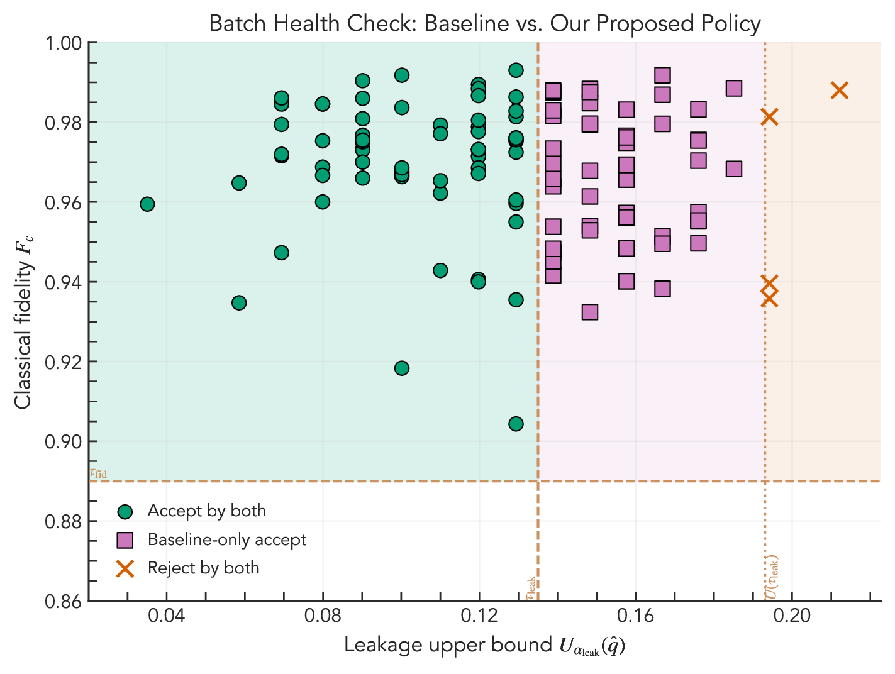
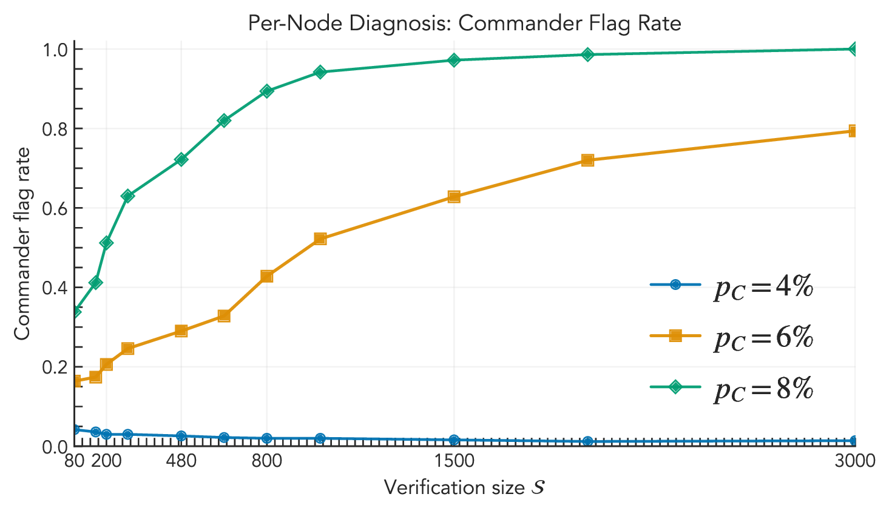

# Lightweight Noise Diagnosis for Photonic Quantum Detectable Byzantine Agreement

## Abstract

Detectable Byzantine Agreement (DBA) protocols abort rather than risk inconsistent decisions when verification fails. Quantum variants (QDBA) implement this detectability via multipartite entanglement checks, but in photonic networks non-uniform noise across participants makes these checks brittle: a handful of noisy nodes can trigger needless aborts or conceal adversarial behavior.

We introduce two drop-in diagnosis methods that run during the standard entanglement-verification step of QDBA protocols: (i) a batch health check that detects both state leakage and insufficient fidelity, and (ii) a per-node diagnosis that estimates each participant's error rates and labels loss-biased outliers. The methods require no extra quantum rounds and add only modest classical overhead.

In simulations, the batch health check substantially reduces false accepts while preserving clean-batch acceptance, and the per-node diagnosis reliably flags noisy Lieutenants and the Commander at practical verification sizes. The techniques are compatible with existing QDBA protocols.

## Quick Start

1. Install dependencies:

```bash
uv sync
```

2. Run all default experiments (policy plane, lieutenant loss-bias detection, commander detection):

```bash
uv run noise_est.py
```

By default, outputs are written to this directory. To choose another output folder:

```bash
uv run noise_est.py --out /path/to/output
```

## Run Individual Experiments

```bash
uv run noise_est.py --figures policy-plane
uv run noise_est.py --figures loss-bias
uv run noise_est.py --figures commander-detection
```

## Paper

- Full paper PDF: [`noise_est.pdf`](./noise_est.pdf)

## Generated Plot Artifacts

- Policy plane: [`noise_est_policy_plane.pdf`](./noise_est_policy_plane.pdf)
  
- Lieutenant loss-bias detection: [`noise_est_loss_bias_detection.pdf`](./noise_est_loss_bias_detection.pdf)
  
- Commander detection: [`noise_est_commander_detection.pdf`](./noise_est_commander_detection.pdf)
  

Related sweep data files:

- [`noise_est_loss_bias_sweep.json`](./noise_est_loss_bias_sweep.json)
- [`noise_est_commander_sweep.json`](./noise_est_commander_sweep.json)
